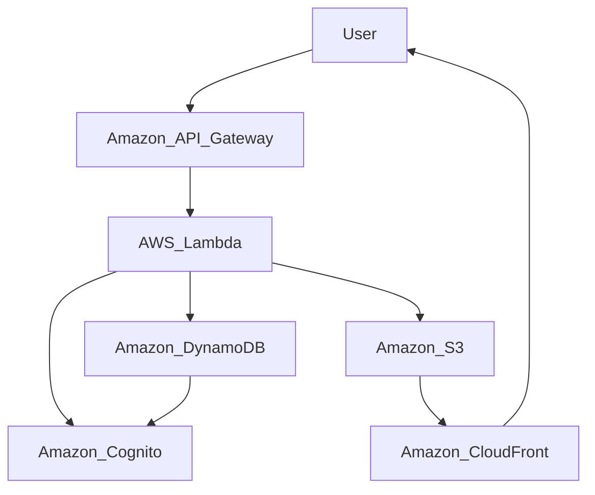

# 1. 코드 구조 설명

### 함수 설명

### 1. `initialize_openai_client`

환경 변수를 로드하고 OpenAI 클라이언트를 초기화합니다.

### 2. `get_or_create_assistant`

 어시스턴트를 생성하거나 기존 어시스턴트를 로드합니다.

### 3. `get_or_create_thread`

스레드를 생성하거나 기존 스레드를 로드합니다.

### 4. `create_and_run_message`

메시지를 생성하고 실행합니다.

### 5. `handle_required_action`

추가 작업이 필요한 경우 이를 처리하고 도구 호출의 출력을 수집합니다.

### 6. `print_run_status`

어시스턴트의 실행 상태를 출력합니다.

### 7. `main`

전체 실행 흐름을 관리합니다. 각 어시스턴트를 정의하고, 요구사항 분석, 시스템 아키텍처 설계, 다이어그램 생성, 비용 추정을 순차적으로 수행합니다.

2. 실행 예시
User input : 유튜브 릴스 기능을 추가하고 싶어.

1) 요구사항 분석 에이전트 실행

```json
{"requirements":"1. 사용자가 릴스(Reels)를 열람할 수 있어야 함.\n2. 사용자가 릴스를 업로드할 수 있어야 함.\n3. 릴스에 좋아요 및 댓글을 달 수 있어야 함.\n4. 릴스를 다른 소셜 미디어 플랫폼에 공유할 수 있어야 함.\n5. 사용자는 릴스를 검색하고 관심 있는 릴스를 팔로우할 수 있어야 함."}
```

2) 시스템 설계 에이전트 실행

```json
{"explain":"To implement the YouTube Reels feature on AWS infrastructure, we can design a serverless architecture using AWS services such as Amazon S3 for storing videos, Amazon API Gateway for handling API requests, AWS Lambda for serverless compute, Amazon DynamoDB for storing user data and interactions, Amazon Cognito for user authentication and authorization, and Amazon CloudFront for content delivery and caching. This architecture will ensure scalability, availability, and cost-efficiency for the YouTube Reels functionality."}
```

3) 다이어그램 생성 에이전트 실행
```json
{"diagram": "graph TD\n    User-->Amazon_API_Gateway\n    Amazon_API_Gateway-->AWS_Lambda\n    AWS_Lambda-->Amazon_DynamoDB\n    AWS_Lambda-->Amazon_S3\n    AWS_Lambda-->Amazon_Cognito\n    Amazon_DynamoDB-->Amazon_Cognito\n    Amazon_S3-->Amazon_CloudFront\n    Amazon_CloudFront-->User"}
```



4) 비용 추정 에이전트 실행

```json
{"cost":"Based on the provided architectural diagram and assuming a daily active user (DAU) count of 100,000, the estimated AWS infrastructure cost is $500 per month. This cost includes expenses for Amazon API Gateway, AWS Lambda, Amazon DynamoDB, Amazon S3, Amazon Cognito, and Amazon CloudFront services."}
```

# 3. 시행 착오

- 간혹 질문이 그대로 답변으로 복사되는 경우가 있음.
    - instruction에 정확하게 답변해달라고 추가함. 완벽하지 않았지만 어느정도 보완됨.

```python
Please ensure the response is in JSON format and includes the specific information requested.
```

- 어시스턴트 하나로만 구성했을때 보다 AWS 서비스를 더 잘 이용하는 편이었음.
- 시간상 못했는데 대규모 설계를 얻기 위해서는 ‘시스템 설계 에이전트 실행’ 다음에 ‘대규모 상황에 고려하여 작성’하는 에이전트가 필요할 것 같음. 시스템 설계 에이전트의 instruction으로 쓰니 무시하고 작성하는 경우가 많음.
- 영어로 답변 달라고 했을때 정확히 답변하는 경우가 더 많았음.
- 답변을 명확하지 않고 두루뭉실하게 설명하는 경우도 있음.

# 느낀점

서비스를 만드는 것은 쉽지만 ‘정확한 프롬프트’를 만드는 것이 어렵다고 느꼈다.

프롬프트를 얼마나 잘 작성하냐로 완성도를 높이는 것을 목표로 공부해야겠다!


#### 추천
https://runwayml.com/research/introducing-gen-3-alpha
